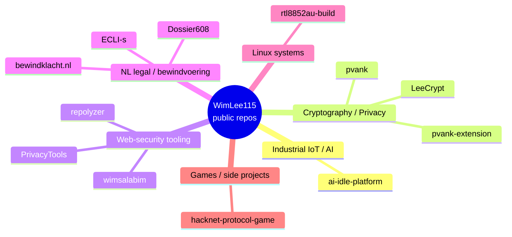

  

[English](#english) · [Nederlands](#nederlands)

---

## English

Solo software engineer in the Netherlands. I build full-stack systems across **industrial IoT, applied cryptography, web-security tooling, kernel-level Linux drivers, and Android apps** — typically end-to-end from device firmware to web dashboard. Open-source where appropriate, proprietary where the business case demands it.

> [!NOTE]
> All my work is independent, audit-grade, and shipped with strict typing, end-to-end tests, and where applicable a verifiable cryptographic chain (Ed25519 signatures, SHA-256 hashing, OpenTimestamps anchoring to the Bitcoin blockchain). No telemetry, no analytics, no third-party trackers in my own products.

### Featured projects

| Project | Domain | Stack | Status |
|---|---|---|---|
| **[AI-IDLE](https://ai-idle.nl)** | Industrial IoT / AI for energy management | PHP · TimescaleDB · MQTT · Modbus · ENTSO-E | Production |
| **[pvank-extension](https://github.com/WimLee115/pvank-extension)** | Browser-side cryptographic page sealing | TypeScript MV3 · Web Crypto API · OpenTimestamps | Active |
| **[wimsalabim](https://pypi.org/project/wimsalabim/)** | Web-security & privacy reconnaissance | Python · pydantic v2 · SARIF 2.1 · Ed25519-signed reports | AGPL-3.0 · on PyPI |
| **[rtl8852au-build](https://github.com/WimLee115/rtl8852au-build)** | Linux kernel driver for Realtek WiFi 6 USB adapters | C · DKMS · kernel 6.17+ | Maintained ⭐ |
| **[LeeCrypt](https://github.com/WimLee115/LeeCrypt)** | Android encryption / decryption / hashing app | Kotlin · AES-256-GCM · ChaCha20-Poly1305 · BLAKE3 | Released ⭐ |

### All public repositories

<b>Complete list — descriptions and links</b>

| Repo | Language | Description |
|---|---|---|
| **[ai-idle-platform](https://github.com/WimLee115/ai-idle-platform)** | PHP | AI-IDLE — Intelligent Industrial IoT Energy Management Platform. AI-powered monitoring, anomaly detection & optimization for manufacturing. |
| **[pvank](https://github.com/WimLee115/pvank)** | TypeScript | Cryptografisch bewijs voor iedereen. SHA-256 + OpenTimestamps + Bitcoin-blockchain. |
| **[pvank-extension](https://github.com/WimLee115/pvank-extension)** | TypeScript | Verzegel deze pagina — cryptographic page seal from your browser. SHA-256 + OpenTimestamps + Bitcoin. Chrome + Firefox MV3. |
| **[wimsalabim](https://github.com/WimLee115/wimsalabim)** | Python | Honest, audit-grade website security & privacy reconnaissance. Ed25519-signed reports, SARIF 2.1 output. |
| **[PrivacyTools](https://github.com/WimLee115/PrivacyTools)** | Shell | WimsPrivacyScanner — quick CLI privacy posture checks. |
| **[repolyzer](https://github.com/WimLee115/repolyzer)** | Python | Instant beautiful insights about any codebase. Like neofetch, but for your repos. On PyPI. |
| **[LeeCrypt](https://github.com/WimLee115/LeeCrypt)** | Kotlin | State-of-the-art Android app for text/file encryption, decryption, hashing. AES-256-GCM, ChaCha20-Poly1305, biometric key storage, steganography, NFC/QR sharing. ⭐ |
| **[rtl8852au-build](https://github.com/WimLee115/rtl8852au-build)** | C | Linux out-of-tree driver for Realtek RTL8852AU/RTL8832AU USB WiFi 6 adapters. Kernel 6.17+, stable monitor mode, web dashboard, full DKMS. ⭐⭐⭐⭐⭐ |
| **[bewindklacht.nl](https://github.com/WimLee115/bewindklacht.nl)** | HTML | Versleuteld, anoniem klachtenkanaal voor beschermingsbewind, curatele en mentorschap in Nederland. Cloudflare Pages · Web Crypto API ECIES. |
| **[Dossier608](https://github.com/WimLee115/Dossier608)** | HTML | Dossier608 — aankondiging publicatie 6 juni 2026 06:06. Vier jaar onderzoek naar de Nederlandse bewindvoeringssector vanuit één cliëntdossier. |
| **[ECLI-s](https://github.com/WimLee115/ECLI-s)** | Python | Verzameling Nederlandse rechtspraak-uitspraken over bewindvoering, mentorschap of curatele. |
| **[hacknet-protocol-game](https://github.com/WimLee115/hacknet-protocol-game)** | TypeScript | Competitive multiplayer hacking simulator. Real-time terminal PvP duels, 35 commands, 5 classes, ELO ranking, full economy. React 19 + Node.js + PostgreSQL + Redis + MongoDB. |

### Technology

| Domain | Stack |
|---|---|
| Frontend | React 19 · TypeScript (strict) · Vite · Tailwind · Zustand · TanStack Query · Recharts · Three.js |
| Backend | Node 22 · Express 5 · Prisma 7 · Apollo GraphQL 5 · Socket.IO · BullMQ · Zod |
| Python | pydantic v2 · httpx · structlog · click · pytest · respx · cryptography |
| AI / ML | TensorFlow.js · ONNX Runtime · scikit-learn · custom agent engine |
| IoT / Edge | Aedes MQTT · Modbus TCP · OPC-UA · BACnet · Shelly · Tasmota · Tuya |
| Energy | ENTSO-E · EPEX Spot · genetic scheduler · battery arbitrage · constraint solver |
| Mobile | Kotlin · Android · PWA |
| Systems | C · Linux kernel modules · DKMS |
| Security | AES-256-GCM · ChaCha20-Poly1305 · Ed25519 · age · OpenTimestamps · post-quantum (PQC) |
| Infrastructure | Docker Compose · Nginx · PostgreSQL + TimescaleDB · Redis · GitHub Actions · OIDC trusted publishers · Cloudflare Pages |

### GitHub stats

  

### Contact

- **E-mail** — [almass-only@protonmail.com](mailto:almass-only@protonmail.com) (preferred; ProtonMail end-to-end where possible)
- **Security disclosures** — GitHub Security Advisories on the relevant repository
- **No** phone, social media, Discord, or messaging-app channels

---

## Nederlands

Solo software engineer in Nederland. Ik bouw full-stack systemen op het gebied van **industriële IoT, toegepaste cryptografie, websecurity-tooling, kernel-level Linux-drivers, en Android-apps** — typisch end-to-end van apparaat-firmware tot webdashboard. Open source waar dat passend is, proprietary waar de business case dat vereist.

> [!NOTE]
> Al mijn werk is onafhankelijk, audit-grade, en wordt afgeleverd met strikte typing, end-to-end tests, en waar van toepassing een verifieerbare cryptografische keten (Ed25519-handtekeningen, SHA-256-hashing, OpenTimestamps-verankering aan de Bitcoin-blockchain). Geen telemetrie, geen analytics, geen externe trackers in mijn eigen producten.

### Uitgelichte projecten

| Project | Domein | Stack | Status |
|---|---|---|---|
| **[AI-IDLE](https://ai-idle.nl)** | Industrieel IoT / AI voor energiemanagement | PHP · TimescaleDB · MQTT · Modbus · ENTSO-E | Productie |
| **[pvank-extension](https://github.com/WimLee115/pvank-extension)** | Browser-side cryptografisch pagina-bewijs | TypeScript MV3 · Web Crypto API · OpenTimestamps | Actief |
| **[wimsalabim](https://pypi.org/project/wimsalabim/)** | Websecurity- en privacy-reconnaissance | Python · pydantic v2 · SARIF 2.1 · Ed25519-gesigneerd | AGPL-3.0 · op PyPI |
| **[rtl8852au-build](https://github.com/WimLee115/rtl8852au-build)** | Linux-kerneldriver voor Realtek WiFi 6 USB-adapters | C · DKMS · kernel 6.17+ | Onderhouden ⭐ |
| **[LeeCrypt](https://github.com/WimLee115/LeeCrypt)** | Android encryptie- / decryptie- / hashing-app | Kotlin · AES-256-GCM · ChaCha20-Poly1305 · BLAKE3 | Vrijgegeven ⭐ |

### Categorie-overzicht (alle publieke repo's)

| Categorie | Repo's |
|---|---|
| **Industrieel IoT / AI** | `ai-idle-platform` |
| **Cryptografie / Privacy** | `pvank` · `pvank-extension` · `LeeCrypt` |
| **Websecurity-tooling** | `wimsalabim` · `PrivacyTools` · `repolyzer` |
| **Bewindvoering / NL juridisch** | `bewindklacht.nl` · `Dossier608` · `ECLI-s` |
| **Linux-systems** | `rtl8852au-build` |
| **Spellen / nevenprojecten** | `hacknet-protocol-game` |

> [!IMPORTANT]
> De repo's onder *Bewindvoering / NL juridisch* (`bewindklacht.nl`, `Dossier608`, `ECLI-s`) houden verband met lopende civielrechtelijke en toezichtkundige procedures in Nederland. Voor inhoudelijke vragen over die context: e-mail met onderwerp **"NL juridisch"** zodat het in het juiste kanaal terechtkomt.

### Contact

- **E-mail** — [almass-only@protonmail.com](mailto:almass-only@protonmail.com) (voorkeur; ProtonMail end-to-end waar mogelijk)
- **Beveiligingsmeldingen** — GitHub Security Advisories op de betreffende repository
- **Geen** telefoon, sociale media, Discord, of messaging-apps

---

  

  <b>WimLee115</b> · Solo software engineer · Netherlands 
  Cryptography · IoT · Privacy · Linux · Android · Industrial automation

